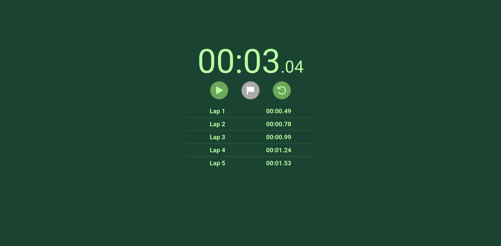

# **Stopwatch using React.js**

My first project built with React.js using Vite.

## Features
- Start/Pause timer button
- Reset timer button
- Add lap button
- List of laps mapped to their times
- Fancy green theme :3

## Tech

- React.js
- Vite

## What I learned

- useState()
- useEffect()
- setInterval()
- Components
- Component props
- React.js project structure
- Using font awesome with React.js

## Setup

1- Clone repository using and navigate to it with the command:
```bash
git clone https://github.com/iyedoo/react-stopwatch.git
cd react-stopwatch
```

2- Install dependencies with the command:
```bash
npm install
```

\* If you don't already npm you can follow the installtion tutorial [here](https://nodejs.org/en/download)

3- Start the development server:
```bash
npm run dev
```

4- Open: **http://localhost:5173/**

## Preview



